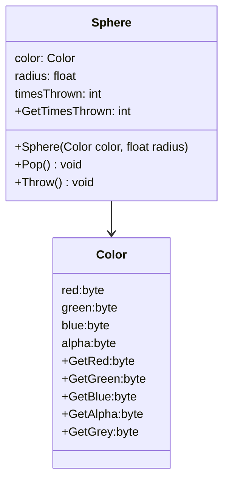

```mermaid

classDiagram
    class Sphere {
    color: Color
    radius: float
    timesThrown: int
    +GetTimesThrown: int

    +Sphere(Color color, float radius)
    +Pop() void
    +Throw() void
    
    }

    class Color {
        red:byte
        green:byte
        blue:byte
        alpha:byte

        +GetRed:byte
        +GetGreen:byte
        +GetBlue:byte
        +GetAlpha:byte
        +GetGrey:byte
    }

    Sphere --> Color


```